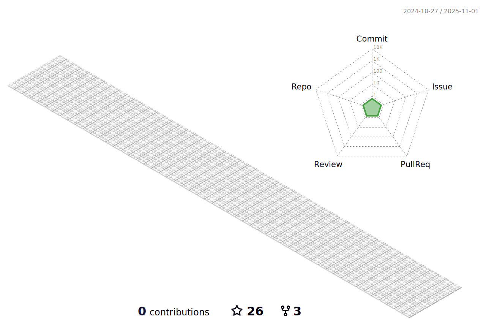

<h1 align="center">Hi 👋, I am Tijani Mukhtar Akande</h1>
<h3 align="center">A passionate frontend developer from Lagos, Nigeria</h3>

  

  

  

- 🌱 I’m currently building my capacity as a **Software Development Frameworks**

- 👨‍💻 All of my projects are available at [https://tijanimukhtarakande.github.io/cv/](https://tijanimukhtarakande.github.io/cv/)

- 📫 How to reach me **tijanimukhtarr@gmail.com**

- 📄 Know about my experiences [https://tijanimukhtarakande.github.io/cv/](https://tijanimukhtarakande.github.io/cv/)
- I am open and actively searching for an Internship or a Entry/Junior Level developer Roles

## 🌐 Socials:
         

<h3 align="left">Languages and Tools:</h3>

 <a href="https://www.cprogramming.com/" target="_blank" rel="noreferrer">             

&nbsp;

